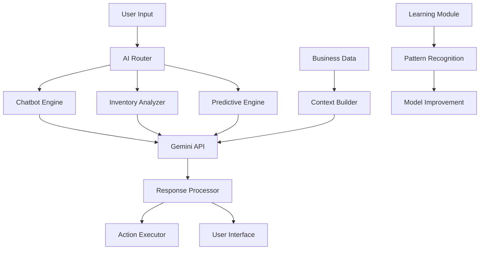

# Katilo ERP System - AI Features Documentation

## Table of Contents
1. [AI Integration Overview](#ai-integration-overview)
2. [Intelligent Chatbot System](#intelligent-chatbot-system)
3. [AI-Powered Inventory Management](#ai-powered-inventory-management)
4. [Predictive Analytics](#predictive-analytics)
5. [Machine Learning Capabilities](#machine-learning-capabilities)
6. [Implementation Details](#implementation-details)
7. [Future AI Enhancements](#future-ai-enhancements)

---

## 1. AI Integration Overview

### 1.1 AI Philosophy in Katilo ERP

The Katilo ERP system integrates artificial intelligence as a core component to enhance business operations through:

- **Intelligent Automation**: Reducing manual tasks through smart automation
- **Predictive Insights**: Providing data-driven forecasts and recommendations
- **Natural Language Interface**: Enabling intuitive user interactions
- **Continuous Learning**: Improving system performance through usage patterns
- **Decision Support**: Assisting users with intelligent suggestions

### 1.2 AI Technology Stack

**Primary AI Engine:**
- **Google Gemini 2.0 Flash**: Advanced large language model
- **Natural Language Processing**: Multi-language support (Arabic/English)
- **Computer Vision**: Image analysis and recognition
- **Contextual Understanding**: Business domain-specific knowledge

**Supporting Technologies:**
- **Python AI Libraries**: NumPy, Pandas for data processing
- **Custom ML Modules**: Specialized business logic
- **Real-time Processing**: Asynchronous AI task handling
- **Data Pipeline**: Automated data preparation for AI analysis

### 1.3 AI Integration Architecture



---

## 2. Intelligent Chatbot System

### 2.1 Chatbot Capabilities

**Core Features:**
- **Natural Language Understanding**: Processes user queries in Arabic and English
- **Context Awareness**: Maintains conversation context across sessions
- **Business Data Integration**: Accesses real-time system data
- **Image Analysis**: Processes uploaded images for inventory and quality control
- **Multi-Session Management**: Handles multiple concurrent conversations

### 2.2 Chatbot Implementation

**Technical Architecture:**
```python
class ChatbotEngine:
    def __init__(self):
        self.model = genai.GenerativeModel("gemini-2.0-flash")
        self.history_manager = ChatHistoryManager()
        self.context_builder = ContextBuilder()
    
    def process_query(self, user_query, chat_id, image_data=None):
        # Build context from business data
        context = self.context_builder.fetch_context_data(user_query)
        
        # Prepare conversation history
        history = self.history_manager.get_chat_session(user_id, chat_id)
        
        # Create comprehensive prompt
        prompt = self.build_prompt(user_query, context, history, image_data)
        
        # Generate AI response
        response = self.model.generate_content(prompt)
        
        # Store conversation
        self.history_manager.add_message(user_id, chat_id, user_query, 'user')
        self.history_manager.add_message(user_id, chat_id, response.text, 'bot')
        
        return response.text
```

**Context Data Integration:**
The chatbot accesses real-time business data including:
- Inventory levels and locations
- Production schedules and status
- Sales orders and customer information
- Supplier details and purchase orders
- Financial summaries and reports

### 2.3 Chatbot Use Cases

**Inventory Queries:**
- "What's the current stock level of Product X?"
- "Which warehouse has the highest inventory turnover?"
- "Show me items below reorder level"

**Production Inquiries:**
- "What's the status of production order #123?"
- "Which production line is most efficient this month?"
- "Are there any quality issues in current batches?"

**Sales Analysis:**
- "Who are our top customers this quarter?"
- "What's the sales trend for Product Y?"
- "Show me pending sales orders"

**Image Analysis:**
- Upload product images for identification
- Quality control image analysis
- Barcode and QR code recognition

### 2.4 Multi-Language Support

**Arabic Language Processing:**
```python
prompt_parts = [
    "أنت 'Hamla Guys'، مساعد ذكي لنظام كاتيلو لإدارة المخزون، المشتريات، الإنتاج، المبيعات، المالية، والشحن.",
    "استخدم فقط البيانات المرفقة ولا تختلق أي معلومات.",
    f"--- بيانات من النظام ---\n{db_context}",
    f"--- سؤال المستخدم ---\n{user_query}"
]
```

**Language Detection and Response:**
- Automatic language detection
- Context-appropriate responses
- Cultural and business context awareness
- Technical term translation

---

## 3. AI-Powered Inventory Management

### 3.1 Intelligent Inventory Analysis

**Automated Analysis Features:**
- **Anomaly Detection**: Identifies unusual inventory patterns
- **Reorder Level Optimization**: Suggests optimal reorder points
- **Category Classification**: Recommends proper item categorization
- **Name Standardization**: Suggests improved item naming conventions

### 3.2 AI Suggestion Engine

**Implementation Process:**
```python
def analyze_item_data(item_id=None, category_id=None, app=None):
    """
    Analyze item data using Gemini AI and generate suggestions
    """
    with app.app_context():
        model = get_gemini_model()
        
        # Collect item data
        if item_id:
            items = Item.query.filter_by(id=item_id).all()
        elif category_id:
            items = Item.query.filter_by(category_id=category_id).all()
        else:
            items = Item.query.limit(100).all()
        
        # Process in batches
        batch_size = 10
        for i in range(0, len(items), batch_size):
            batch_items = items[i:i+batch_size]
            process_item_batch(model, batch_items)
            time.sleep(2)  # Rate limiting
```

**Suggestion Types:**
1. **Name Improvement**: Better product naming
2. **Category Mismatch**: Incorrect categorization detection
3. **Reorder Level Adjustment**: Optimal stock level recommendations
4. **Inventory Anomaly**: Unusual patterns identification

### 3.3 Predictive Inventory Management

**Demand Forecasting:**
- Historical sales analysis
- Seasonal trend identification
- Market demand prediction
- Supply chain optimization

**Stock Optimization:**
- Automated reorder suggestions
- Safety stock calculations
- Lead time optimization
- Carrying cost minimization

### 3.4 Real-time Monitoring

**AI-Driven Alerts:**
- Low stock warnings
- Overstock notifications
- Expiration date alerts
- Quality issue detection

**Performance Metrics:**
- Inventory turnover analysis
- Stock accuracy measurements
- Cost optimization tracking
- Supplier performance evaluation

---

## 4. Predictive Analytics

### 4.1 Sales Forecasting

**Predictive Models:**
- Time series analysis for sales trends
- Customer behavior prediction
- Market demand forecasting
- Revenue projection models

**Implementation Features:**
```python
class SalesPredictor:
    def __init__(self):
        self.model = genai.GenerativeModel("gemini-2.0-flash")
    
    def forecast_demand(self, item_id, time_period):
        # Gather historical sales data
        sales_history = self.get_sales_history(item_id, time_period)
        
        # Analyze seasonal patterns
        seasonal_data = self.analyze_seasonality(sales_history)
        
        # Generate forecast
        forecast_prompt = self.build_forecast_prompt(sales_history, seasonal_data)
        prediction = self.model.generate_content(forecast_prompt)
        
        return self.parse_forecast_response(prediction.text)
```

### 4.2 Production Optimization

**Efficiency Analysis:**
- Production line performance monitoring
- Resource utilization optimization
- Quality prediction models
- Maintenance scheduling

**Predictive Maintenance:**
- Equipment failure prediction
- Optimal maintenance timing
- Cost-benefit analysis
- Downtime minimization

### 4.3 Quality Control Predictions

**Quality Forecasting:**
- Defect rate prediction
- Quality trend analysis
- Process optimization suggestions
- Supplier quality assessment

**Automated Quality Checks:**
- Image-based quality inspection
- Pattern recognition for defects
- Automated pass/fail decisions
- Quality report generation

---

## 5. Machine Learning Capabilities

### 5.1 Learning from User Interactions

**Feedback Loop Implementation:**
- User action tracking
- Decision outcome analysis
- Model performance evaluation
- Continuous improvement cycles

**Pattern Recognition:**
- User behavior analysis
- Business process optimization
- Workflow improvement suggestions
- Efficiency enhancement recommendations

### 5.2 Custom ML Models

**Business-Specific Models:**
- Inventory optimization algorithms
- Customer segmentation models
- Price optimization engines
- Supply chain optimization

**Model Training Pipeline:**
```python
class MLModelTrainer:
    def __init__(self):
        self.data_processor = DataProcessor()
        self.model_evaluator = ModelEvaluator()
    
    def train_inventory_model(self):
        # Collect training data
        training_data = self.data_processor.prepare_inventory_data()
        
        # Feature engineering
        features = self.data_processor.extract_features(training_data)
        
        # Model training
        model = self.train_model(features)
        
        # Model evaluation
        performance = self.model_evaluator.evaluate(model)
        
        return model, performance
```

### 5.3 Data-Driven Insights

**Business Intelligence:**
- Automated report generation
- Key performance indicator tracking
- Trend analysis and visualization
- Strategic recommendation engine

**Decision Support:**
- Risk assessment models
- Opportunity identification
- Resource allocation optimization
- Strategic planning assistance

---

## 6. Implementation Details

### 6.1 AI Service Architecture

**Microservice Design:**
```python
class AIService:
    def __init__(self):
        self.gemini_client = GeminiClient()
        self.data_manager = DataManager()
        self.cache_manager = CacheManager()
    
    async def process_ai_request(self, request_type, data):
        # Check cache first
        cached_result = self.cache_manager.get(request_type, data)
        if cached_result:
            return cached_result
        
        # Process with AI
        result = await self.gemini_client.process(request_type, data)
        
        # Cache result
        self.cache_manager.set(request_type, data, result)
        
        return result
```

### 6.2 Performance Optimization

**Caching Strategy:**
- Response caching for common queries
- Context data caching
- Model result caching
- Session state management

**Asynchronous Processing:**
- Background AI task processing
- Queue management for AI requests
- Load balancing for AI services
- Timeout handling and retry logic

### 6.3 Error Handling and Reliability

**Robust Error Management:**
```python
class AIErrorHandler:
    def handle_ai_error(self, error, context):
        if isinstance(error, RateLimitError):
            return self.handle_rate_limit(error, context)
        elif isinstance(error, APIError):
            return self.handle_api_error(error, context)
        else:
            return self.handle_generic_error(error, context)
    
    def fallback_response(self, context):
        return "I'm experiencing technical difficulties. Please try again later."
```

---

## 7. Future AI Enhancements

### 7.1 Advanced AI Features

**Planned Enhancements:**
- Voice interaction capabilities
- Advanced computer vision for quality control
- Automated decision-making systems
- Real-time optimization engines

### 7.2 Integration Expansions

**External AI Services:**
- Multi-model AI integration
- Specialized industry AI tools
- Cloud AI service integration
- Edge AI deployment

### 7.3 Custom AI Development

**In-House AI Capabilities:**
- Custom neural network development
- Domain-specific model training
- Proprietary algorithm development
- AI research and development

---

## Conclusion

The AI integration in the Katilo ERP system represents a significant advancement in enterprise software capabilities. By leveraging Google's Gemini AI model and implementing custom AI solutions, the system provides intelligent automation, predictive insights, and natural language interfaces that enhance user productivity and business decision-making.

The comprehensive AI architecture supports current business needs while providing a foundation for future AI enhancements and custom model development. This positions the Katilo ERP system as a forward-thinking solution that can adapt and evolve with advancing AI technologies.
