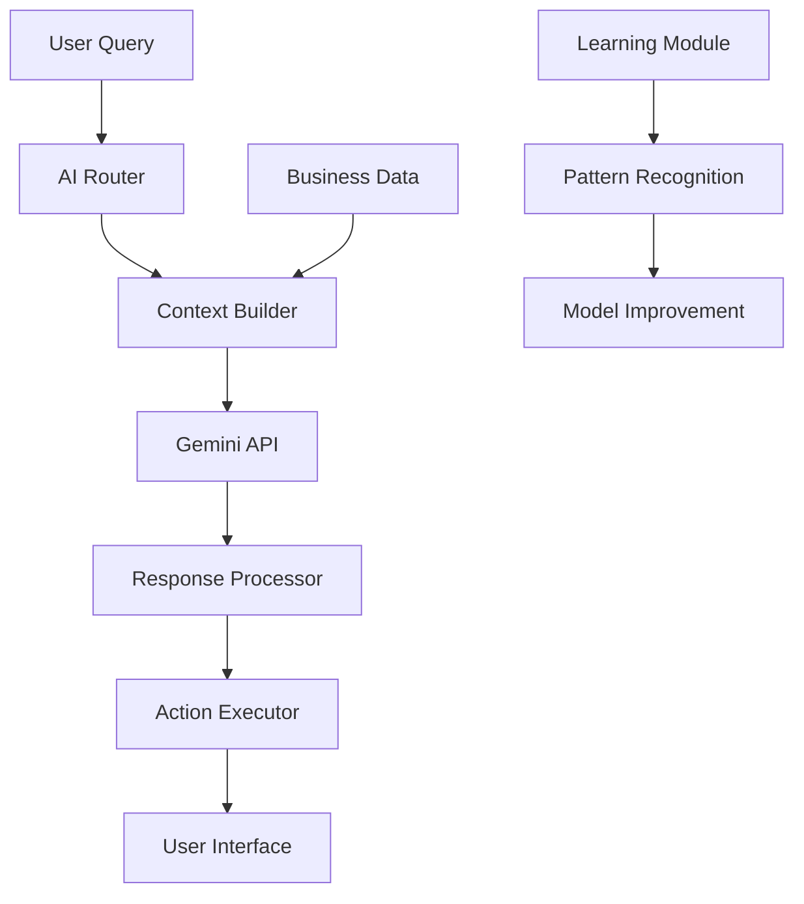

# Katilo ERP System

## 🚀 Advanced Enterprise Resource Planning System with AI Integration

[](https://python.org)
[](https://flask.palletsprojects.com)
[](https://postgresql.org)
[](https://ai.google.dev)
[](LICENSE)

---

## 📋 Table of Contents

- [Overview](#overview)
- [Key Features](#key-features)
- [AI Integration](#ai-integration)
- [Technology Stack](#technology-stack)
- [Quick Start](#quick-start)
- [Documentation](#documentation)
- [Screenshots](#screenshots)
- [Contributing](#contributing)
- [License](#license)

---

## 🌟 Overview

Katilo ERP is a comprehensive Enterprise Resource Planning system designed for modern businesses. Built with cutting-edge technologies and powered by Google's Gemini AI, it provides intelligent automation, real-time analytics, and seamless business process management.

### 🎯 Purpose

This system was developed as a graduation project to demonstrate the integration of traditional ERP functionality with modern AI capabilities, showcasing how artificial intelligence can enhance business operations and decision-making processes.

### 🏢 Target Industries

- Manufacturing companies
- Distribution centers
- Retail businesses
- Small to medium enterprises (SMEs)
- Multi-location operations

---

## ✨ Key Features

### 📦 Inventory Management
- **Real-time Stock Tracking**: Multi-warehouse inventory monitoring
- **Smart Reordering**: AI-powered reorder level optimization
- **Warehouse Layout**: Visual warehouse mapping with sections and slots
- **Batch Tracking**: Complete lot and batch traceability
- **Weight & Volume**: Advanced item dimension management

### 🏭 Production Management
- **Bill of Materials (BOM)**: Multi-level BOM support with cost analysis
- **Production Planning**: Advanced scheduling and resource allocation
- **Quality Control**: Comprehensive QC workflows and testing
- **Packaging Operations**: Integrated packaging management
- **Efficiency Tracking**: Real-time production performance monitoring

### 💼 Sales & Customer Management
- **CRM Integration**: Complete customer relationship management
- **Order Processing**: Streamlined sales order workflows
- **Invoice Generation**: Professional PDF invoice creation
- **Payment Tracking**: Multi-method payment processing
- **Returns Management**: Comprehensive return and refund handling

### 🛒 Purchasing & Supplier Management
- **Supplier Portal**: Complete vendor relationship management
- **Purchase Orders**: Automated procurement workflows
- **Cost Tracking**: Historical cost analysis and optimization
- **Payment Management**: Supplier payment and ledger tracking
- **Performance Analytics**: Supplier performance evaluation

### 💰 Financial Management
- **Cash Management**: Multi-account cash flow tracking
- **Transaction Recording**: Comprehensive financial transaction logs
- **Reconciliation**: Automated account reconciliation
- **Financial Reporting**: Advanced financial analytics and reports

### 🚚 Distribution & Logistics
- **Vehicle Management**: Fleet tracking and optimization
- **Route Planning**: Intelligent delivery route optimization
- **Shipment Tracking**: Real-time shipment monitoring
- **Delivery Confirmation**: Digital delivery verification

---

## 🤖 AI Integration

### 🧠 Google Gemini 2.0 Flash Integration

The system leverages Google's most advanced AI model for:

#### 💬 Intelligent Chatbot
- **Natural Language Processing**: Understands queries in Arabic and English
- **Context Awareness**: Maintains conversation context across sessions
- **Business Data Integration**: Accesses real-time system data
- **Image Analysis**: Processes uploaded images for inventory and QC
- **Multi-session Management**: Handles concurrent conversations

#### 📊 Smart Inventory Analysis
- **Anomaly Detection**: Identifies unusual inventory patterns
- **Reorder Optimization**: Suggests optimal reorder points
- **Category Classification**: Recommends proper item categorization
- **Name Standardization**: Improves item naming conventions

#### 🔮 Predictive Analytics
- **Demand Forecasting**: Predicts future demand patterns
- **Sales Trends**: Analyzes sales performance trends
- **Production Optimization**: Optimizes manufacturing processes
- **Quality Prediction**: Predicts quality issues before they occur

#### 🎯 Intelligent Suggestions
- **Automated Recommendations**: AI-generated business insights
- **Process Optimization**: Workflow improvement suggestions
- **Cost Optimization**: Cost reduction recommendations
- **Performance Enhancement**: Efficiency improvement insights

### 🔄 AI Workflow Example



---

## 🛠 Technology Stack

### Backend
- **Framework**: Flask 2.3+ (Python web framework)
- **Database**: PostgreSQL 12+ (Advanced relational database)
- **ORM**: SQLAlchemy (Object-relational mapping)
- **Authentication**: Flask-Login (Session management)
- **Migration**: Flask-Migrate (Database versioning)

### Frontend
- **Languages**: HTML5, CSS3, JavaScript (ES6+)
- **Framework**: Vue.js (Progressive JavaScript framework)
- **UI Library**: Bootstrap 5 (Responsive design)
- **Icons**: Font Awesome (Icon library)

### AI & Analytics
- **AI Engine**: Google Gemini 2.0 Flash
- **Data Processing**: Pandas, NumPy
- **Natural Language**: Multi-language support (Arabic/English)
- **Computer Vision**: Image analysis capabilities

### PDF Generation
- **Engine**: wkhtmltopdf (High-quality PDF generation)
- **Templates**: Jinja2 (Dynamic template rendering)
- **Formats**: Multiple page sizes and layouts

### Production Server
- **WSGI Server**: Waitress (Production-ready server)
- **Reverse Proxy**: Nginx (Optional, for high-traffic)
- **SSL**: Let's Encrypt (Free SSL certificates)

---

## 🚀 Quick Start

### Prerequisites
- Python 3.8 or higher
- PostgreSQL 12 or higher
- Git
- Google Gemini API key

### Installation

1. **Clone the Repository**
   ```bash
   git clone <repository-url>
   cd katilo-system-postgresql
   ```

2. **Create Virtual Environment**
   ```bash
   python -m venv venv
   source venv/bin/activate  # On Windows: venv\Scripts\activate
   ```

3. **Install Dependencies**
   ```bash
   pip install -r requirements.txt
   ```

4. **Setup Environment Variables**
   ```bash
   cp .env.example .env
   # Edit .env with your configuration
   ```

5. **Initialize Database**
   ```bash
   flask db upgrade
   python utils/database_seeder.py
   ```

6. **Run the Application**
   ```bash
   # Development mode
   python app.py
   
   # Production mode
   python wsgi.py
   ```

7. **Access the System**
   - Open browser to `http://localhost:5000`
   - Login with default admin credentials
   - Start exploring the system!

### Docker Deployment (Optional)

```bash
# Build and run with Docker
docker-compose up -d
```

---

## 📚 Documentation

### 📖 Complete Documentation Suite

| Document | Description |
|----------|-------------|
| [**Main Documentation**](KATILO_ERP_DOCUMENTATION.md) | Comprehensive system overview and features |
| [**Technical Architecture**](TECHNICAL_ARCHITECTURE.md) | Detailed technical implementation guide |
| [**AI Features Guide**](AI_FEATURES_DOCUMENTATION.md) | Complete AI integration documentation |
| [**User Manual**](USER_MANUAL.md) | Step-by-step user guide |
| [**Installation Guide**](INSTALLATION_GUIDE.md) | Detailed setup and deployment instructions |
| [**API Documentation**](API_DOCUMENTATION.md) | Complete API reference |

### 🎓 Academic Context

This project serves as a comprehensive graduation project demonstrating:
- Modern web application development
- AI integration in enterprise software
- Database design and optimization
- User experience design
- System architecture and scalability
- Real-world business process automation

---

## 📸 Screenshots

### Dashboard Overview

*Main dashboard with real-time KPIs and AI insights*

### AI Chatbot Interface

*Intelligent chatbot with natural language processing*

### Inventory Management

*Comprehensive inventory tracking and management*

### Production Planning

*Advanced production planning and quality control*

---

## 🤝 Contributing

We welcome contributions to the Katilo ERP system! Please read our contributing guidelines:

### Development Setup
1. Fork the repository
2. Create a feature branch
3. Make your changes
4. Add tests for new features
5. Submit a pull request

### Code Standards
- Follow PEP 8 for Python code
- Use meaningful variable and function names
- Add docstrings for all functions and classes
- Write unit tests for new features
- Update documentation as needed

---

## 📄 License

This project is licensed under the MIT License - see the [LICENSE](LICENSE) file for details.

---

## 🙏 Acknowledgments

- **Google AI**: For providing the Gemini API
- **Flask Community**: For the excellent web framework
- **PostgreSQL Team**: For the robust database system
- **Open Source Community**: For the amazing tools and libraries

---

## 📞 Support

### Getting Help
- 📧 **Email**: support@katilo-erp.com
- 💬 **Discord**: [Join our community](https://discord.gg/katilo-erp)
- 📖 **Documentation**: [Complete docs](docs/)
- 🐛 **Issues**: [GitHub Issues](https://github.com/katilo-erp/issues)

### Professional Services
- 🏢 **Enterprise Support**: Custom implementations and support
- 🎓 **Training**: User and administrator training programs
- 🔧 **Consulting**: System optimization and customization
- 🚀 **Deployment**: Professional deployment services

---

## 🌟 Star History

[](https://star-history.com/#katilo-erp/katilo-system&Date)

---

## 🔮 Roadmap

### Upcoming Features
- [ ] Mobile application (iOS/Android)
- [ ] Advanced analytics dashboard
- [ ] IoT device integration
- [ ] Blockchain supply chain tracking
- [ ] Advanced AI models
- [ ] Multi-tenant architecture
- [ ] API marketplace
- [ ] Third-party integrations

---

**Made with ❤️ by the Katilo ERP Team**

*Empowering businesses with intelligent automation and seamless operations.*
