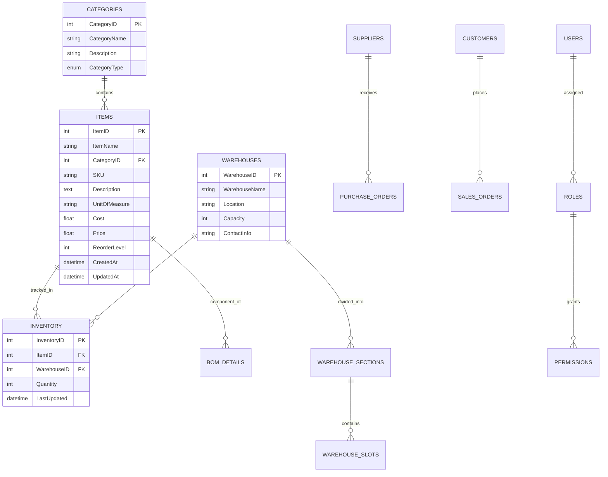

# Katilo ERP System - Technical Architecture Documentation

## Table of Contents
1. [System Architecture Overview](#system-architecture-overview)
2. [Database Design](#database-design)
3. [Application Structure](#application-structure)
4. [AI Integration Architecture](#ai-integration-architecture)
5. [Security Architecture](#security-architecture)
6. [Performance Considerations](#performance-considerations)

---

## 1. System Architecture Overview

### 1.1 High-Level Architecture

The Katilo ERP system follows a three-tier architecture pattern:

```
┌─────────────────────────────────────────────────────────────┐
│                    Presentation Tier                        │
│  ┌─────────────┐  ┌─────────────┐  ┌─────────────────────┐  │
│  │   Web UI    │  │   Mobile    │  │    API Clients      │  │
│  │ (HTML/JS)   │  │    App      │  │   (Third-party)     │  │
│  └─────────────┘  └─────────────┘  └─────────────────────┘  │
└─────────────────────────────────────────────────────────────┘
                              │
                              ▼
┌─────────────────────────────────────────────────────────────┐
│                    Application Tier                         │
│  ┌─────────────┐  ┌─────────────┐  ┌─────────────────────┐  │
│  │    Flask    │  │     AI      │  │    Background       │  │
│  │   Server    │  │  Services   │  │     Workers         │  │
│  └─────────────┘  └─────────────┘  └─────────────────────┘  │
└─────────────────────────────────────────────────────────────┘
                              │
                              ▼
┌─────────────────────────────────────────────────────────────┐
│                      Data Tier                              │
│  ┌─────────────┐  ┌─────────────┐  ┌─────────────────────┐  │
│  │ PostgreSQL  │  │    Redis    │  │    File Storage    │  │
│  │  Database   │  │   Cache     │  │   (Documents/PDFs) │  │
│  └─────────────┘  └─────────────┘  └─────────────────────┘  │
└─────────────────────────────────────────────────────────────┘
```

### 1.2 Component Interaction

**Request Flow:**
1. User interacts with web interface
2. JavaScript sends AJAX requests to Flask routes
3. Flask processes business logic
4. SQLAlchemy ORM handles database operations
5. AI services provide intelligent insights
6. Response returned to user interface

### 1.3 Microservices Consideration

While currently monolithic, the system is designed with modularity in mind for future microservices migration:

**Potential Service Boundaries:**
- Inventory Service
- Production Service
- Sales Service
- AI/Analytics Service
- Notification Service
- Document Service

---

## 2. Database Design

### 2.1 Entity Relationship Diagram



### 2.2 Key Database Tables

**Core Business Entities:**
- `categories` - Product categorization
- `items` - Product master data
- `warehouses` - Storage locations
- `inventory` - Stock levels
- `inventory_transactions` - Stock movements

**Manufacturing:**
- `bom` - Bill of Materials headers
- `bom_details` - BOM line items
- `production_orders` - Production planning
- `production_lines` - Manufacturing lines
- `quality_checks` - QC processes

**Sales & Purchasing:**
- `customers` - Customer master
- `sales_orders` - Sales transactions
- `suppliers` - Vendor master
- `purchase_orders` - Procurement

**System Management:**
- `users` - System users
- `roles` - User roles
- `permissions` - Access rights
- `system_settings` - Configuration

### 2.3 Database Optimization

**Indexing Strategy:**
```sql
-- Performance-critical indexes
CREATE INDEX idx_inventory_item_warehouse ON inventory(item_id, warehouse_id);
CREATE INDEX idx_transactions_date ON inventory_transactions(transaction_date);
CREATE INDEX idx_items_sku ON items(sku);
CREATE INDEX idx_sales_orders_customer ON sales_orders(customer_id);
CREATE INDEX idx_purchase_orders_supplier ON purchase_orders(supplier_id);
```

**Query Optimization:**
- Use of SQLAlchemy query optimization
- Eager loading for related entities
- Pagination for large datasets
- Database connection pooling

---

## 3. Application Structure

### 3.1 Flask Application Organization

```
katilo-system-postgresql/
├── app.py                      # Main application entry
├── models.py                   # Database models
├── config.py                   # Configuration settings
├── requirements.txt            # Python dependencies
├── routes/                     # Route handlers
│   ├── __init__.py
│   ├── inventory_routes.py
│   ├── production_routes.py
│   ├── sales_routes.py
│   ├── chatbot_routes.py
│   └── ai_suggestions_routes.py
├── utils/                      # Utility modules
│   ├── pdf_generator.py
│   ├── ai_suggestions.py
│   ├── database_seeder.py
│   └── invoice_pdf_generator.py
├── templates/                  # HTML templates
│   ├── base.html
│   ├── dashboard.html
│   ├── inventory/
│   ├── production/
│   └── sales/
├── static/                     # Static assets
│   ├── css/
│   ├── js/
│   └── images/
└── migrations/                 # Database migrations
```

### 3.2 Blueprint Architecture

**Modular Route Organization:**
```python
# Example blueprint structure
from flask import Blueprint

inventory_bp = Blueprint('inventory', __name__, url_prefix='/inventory')
production_bp = Blueprint('production', __name__, url_prefix='/production')
sales_bp = Blueprint('sales', __name__, url_prefix='/sales')
ai_suggestions_bp = Blueprint('ai_suggestions', __name__, url_prefix='/api/ai-suggestions')
chatbot_bp = Blueprint('chatbot', __name__, url_prefix='/api/chatbot')

# Register blueprints in main app
app.register_blueprint(inventory_bp)
app.register_blueprint(production_bp)
app.register_blueprint(sales_bp)
app.register_blueprint(ai_suggestions_bp)
app.register_blueprint(chatbot_bp)
```

### 3.3 Model Relationships

**SQLAlchemy ORM Design:**
```python
class Item(db.Model):
    __tablename__ = 'items'
    id = db.Column('ItemID', db.Integer, primary_key=True)
    name = db.Column('ItemName', db.String(100), nullable=False)
    category_id = db.Column('CategoryID', db.Integer, db.ForeignKey('categories.CategoryID'))
    
    # Relationships
    inventories = db.relationship('Inventory', backref='item', lazy=True)
    bom_components = db.relationship('BOMDetail', backref='component_item', lazy=True)
    transactions = db.relationship('InventoryTransaction', backref='item', lazy=True)

class Inventory(db.Model):
    __tablename__ = 'inventory'
    id = db.Column('InventoryID', db.Integer, primary_key=True)
    item_id = db.Column('ItemID', db.Integer, db.ForeignKey('items.ItemID'))
    warehouse_id = db.Column('WarehouseID', db.Integer, db.ForeignKey('warehouses.WarehouseID'))
    quantity = db.Column('Quantity', db.Integer, nullable=False)
```

---

## 4. AI Integration Architecture

### 4.1 Google Gemini Integration

**API Configuration:**
```python
import google.generativeai as genai
from dotenv import load_dotenv

load_dotenv()
GEMINI_API_KEY = os.getenv("GEMINI_API_KEY")
genai.configure(api_key=GEMINI_API_KEY)
model = genai.GenerativeModel("gemini-2.0-flash")
```

**AI Service Architecture:**
```
┌─────────────────┐    ┌─────────────────┐    ┌─────────────────┐
│   User Query    │───►│   AI Processor  │───►│  Gemini API     │
└─────────────────┘    └─────────────────┘    └─────────────────┘
                              │                        │
                              ▼                        ▼
┌─────────────────┐    ┌─────────────────┐    ┌─────────────────┐
│  Context Data   │───►│  Prompt Builder │◄───│  AI Response    │
└─────────────────┘    └─────────────────┘    └─────────────────┘
                              │
                              ▼
                       ┌─────────────────┐
                       │  Response       │
                       │  Processor      │
                       └─────────────────┘
```

### 4.2 AI Features Implementation

**Chatbot System:**
- Natural language processing
- Context-aware responses
- Multi-session management
- Image analysis capabilities

**Inventory Intelligence:**
- Automated anomaly detection
- Reorder level optimization
- Category classification
- Name standardization

**Predictive Analytics:**
- Demand forecasting
- Production optimization
- Quality prediction
- Maintenance scheduling

### 4.3 AI Data Pipeline

**Data Flow for AI Processing:**
1. **Data Collection**: Gather relevant business data
2. **Data Preprocessing**: Clean and format data
3. **Context Building**: Create AI-friendly context
4. **AI Processing**: Send to Gemini API
5. **Response Processing**: Parse and validate AI response
6. **Action Execution**: Implement AI suggestions
7. **Feedback Loop**: Learn from user interactions

---

## 5. Security Architecture

### 5.1 Authentication & Authorization

**Role-Based Access Control (RBAC):**
```python
class User(UserMixin, db.Model):
    id = db.Column(db.Integer, primary_key=True)
    username = db.Column(db.String(80), unique=True, nullable=False)
    password_hash = db.Column(db.String(120), nullable=False)
    role_id = db.Column(db.Integer, db.ForeignKey('roles.id'))
    
    def has_permission(self, permission_name):
        return self.role.has_permission(permission_name)

class Role(db.Model):
    id = db.Column(db.Integer, primary_key=True)
    name = db.Column(db.String(50), unique=True, nullable=False)
    permissions = db.relationship('Permission', secondary='role_permissions')
```

**Security Layers:**
1. **Authentication**: User login verification
2. **Session Management**: Secure session handling
3. **Authorization**: Permission-based access
4. **Data Validation**: Input sanitization
5. **API Security**: Rate limiting and validation

### 5.2 Data Protection

**Security Measures:**
- Password hashing using Werkzeug
- SQL injection prevention via ORM
- XSS protection through template escaping
- CSRF token validation
- Secure session cookies
- HTTPS enforcement in production

### 5.3 API Security

**Protection Mechanisms:**
- Rate limiting for API endpoints
- Input validation and sanitization
- Authentication tokens for API access
- Request/response logging
- Error handling without information disclosure

---

## 6. Performance Considerations

### 6.1 Database Performance

**Optimization Strategies:**
- Strategic indexing on frequently queried columns
- Query optimization using SQLAlchemy
- Database connection pooling
- Lazy loading for relationships
- Pagination for large datasets

### 6.2 Application Performance

**Caching Strategy:**
- Session-based caching
- Query result caching
- Static asset caching
- CDN integration for static files

**Code Optimization:**
- Efficient algorithm implementation
- Memory usage optimization
- Asynchronous processing for long tasks
- Background job processing

### 6.3 Scalability Planning

**Horizontal Scaling:**
- Load balancer configuration
- Database read replicas
- Microservices migration path
- Container orchestration

**Vertical Scaling:**
- Resource monitoring
- Performance profiling
- Bottleneck identification
- Hardware optimization

---

## Conclusion

The Katilo ERP system's technical architecture provides a solid foundation for enterprise-level operations while maintaining flexibility for future enhancements. The modular design, comprehensive security measures, and AI integration capabilities position the system as a modern, scalable solution for business management needs.

The architecture supports both current operational requirements and future growth, with clear migration paths to microservices and cloud-native deployments as business needs evolve.
